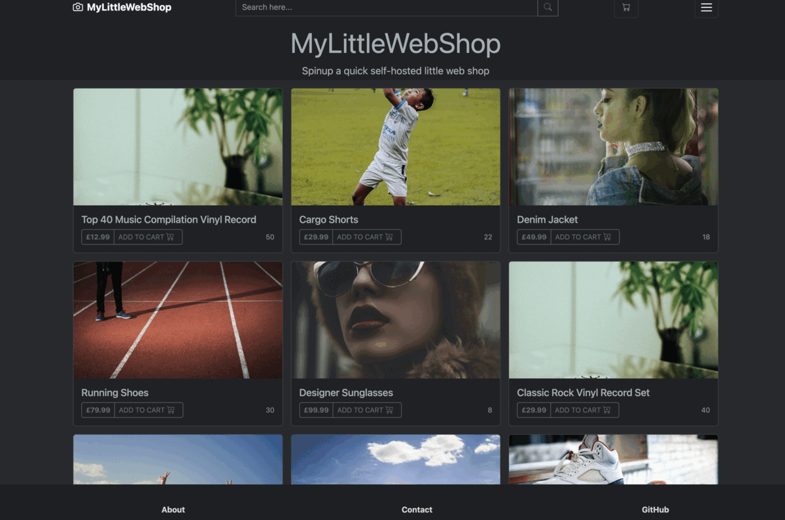

[](https://choosealicense.com/licenses/mit)


#
## Table of Contents

* [Description](#description)
* [Table of Contents](#table-of-contents)
* [Installation](#installation)
* [Usage](#usage)
* [Walkthrough](#walkthrough)
* [Demo](#demo)
* [Link](#link)
* [Authors](#authors)
* [License](#license)
#
## Description

Welcome to our LittleWebShop, where shopping meets convenience and quality! We are passionate about providing you with a seamless and enjoyable online shopping experience. Allow us to introduce ourselves and give you a glimpse into who we are.

At our e-commerce store, we believe that shopping should be a delightful journey, right from the comfort of your own home. We understand the importance of offering a wide range of products that cater to your diverse needs and interests. From fashion and beauty to home decor and electronics, we strive to curate an extensive collection that meets your lifestyle demands.

Our team is dedicated to handpicking each product with meticulous care. We prioritize quality, ensuring that every item we feature meets stringent standards. We collaborate with trusted suppliers and brands, ensuring that you receive only the best products that surpass your expectations.

Customer satisfaction is at the core of our philosophy. We aim to exceed your expectations by providing excellent customer service, prompt assistance, and timely deliveries. Our dedicated support team is always ready to answer your questions and address any concerns you may have throughout your shopping journey.

We believe in the power of innovation and technology. Our user-friendly website is designed to offer you a seamless and intuitive browsing experience. We regularly update our platform to incorporate the latest advancements, ensuring that you have access to cutting-edge features and functionalities.

We also understand the importance of security and privacy. Rest assured, your personal information and payment details are protected with robust encryption protocols. Your trust is paramount to us, and we take every measure to safeguard your data.

But we're not just an online store; we're a community. We value your feedback and suggestions, as they help us continually improve our offerings and tailor our services to your needs. We strive to create a space where like-minded individuals can connect, share their experiences, and find inspiration.

Join us on this exciting journey of exploration and discovery. Whether you're searching for the latest fashion trends, unique gifts, or everyday essentials, we're here to make your shopping experience seamless, enjoyable, and rewarding. We invite you to explore our LittleWebShop and embark on a shopping adventure like no other.

Thank you for choosing us. We're thrilled to have you as part of our vibrant and ever-growing community.

Happy shopping!
#
## Installation

You can clone the git repository and run next command to use tha web application locally

Install all dependencies

```
  npm install
```

Seed the database

```
  npm run seed
```

Start the server

```
  npm run start
```
#
## Usage
In order to use the program you will need to clone the repository from GitHub provided in the link below.

#
## How to Contribute
For and suggestions or contributions you can reach me at my email address or you can clone to code and edit it the way it will suite you the best.
#
## Walkthrough Video
#
[](https://drive.google.com/file/d/1KBccUEZynfG1GfyiN6Vm40K3h0MgaXGY/view?usp=sharing)
#
## Demo



#
## Link
Link to repository:

https://github.com/kristiyantefov/mylittlewebshop

Link to website:


https://mylittlewebshop.herokuapp.com
#
## Authors

- [Kristiyan](https://github.com/kristiyantefov)

- [Rehards](https://github.com/dexit)

- [Abdishkur](https://github.com/Karbuuno)

- [Ashley](https://github.com/Dovahkiin1993)

#
## License

- This application is covered under: [MIT License](https://choosealicense.com/licenses/mit)

